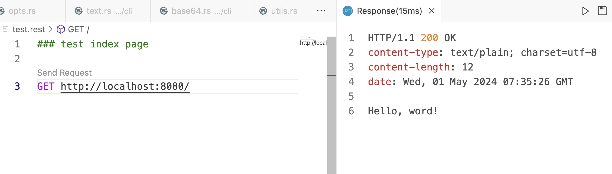
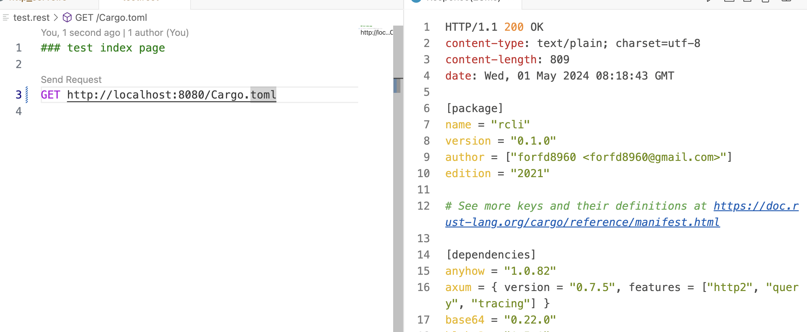

# RCli

**Rust Cli Tool✌️** ✌️

## Errors

### cargo deny check failed

```
[ERROR] failed to open advisory database: "$HOME/.cargo/advisory-db/github.com-2f857891b7f43c59" does not appear to be a git repository: Could not retrieve metadata of "$HOME/.cargo/advisory-db/github.com-2f857891b7f43c59": No such file or directory (os error 2)
```

fix by adding:

refer: https://github.com/EmbarkStudios/cargo-deny/pull/420

```toml
[advisories]
git-fetch-with-cli = true
```

## CSV

### install dependency

```sh
cargo add clap --features derive

cargo add csv

cargo add serde --features derive

cargo add anyhow

cargo add serde-json
```

```sh
Usage: rcli <COMMAND>

Commands:
  csv   convert csv to json
  help  Print this message or the help of the given subcommand(s)

Options:
  -h, --help     Print help
  -V, --version  Print version


❯ cargo run -- csv -i test.csv
warning: unused manifest key: package.author
   Compiling rcli v0.1.0
    Finished dev [unoptimized + debuginfo] target(s) in 0.38s
     Running `target/debug/rcli csv -i test.csv`
Opts { cmd: Csv(CsvOpts { input: "test.csv", output: "output.json", delimiter: ',', header: true }) }
```

### Value parser

```sh
❯ cargo run -- csv -i test.csv
warning: unused manifest key: package.author
   Compiling rcli v0.1.0
    Finished dev [unoptimized + debuginfo] target(s) in 0.45s
     Running `target/debug/rcli csv -i test.csv`
error: invalid value 'test.csv' for '--input <INPUT>': File is not exists
```

## Base64

```sh
❯ cargo run -- base64 encode -i abc
warning: unused manifest key: package.author
   Compiling rcli v0.1.0
    Finished dev [unoptimized + debuginfo] target(s) in 1.28s
     Running `target/debug/rcli base64 encode -i abc`
Opts { cmd: Base64(Encode(Base64EncodeOpts { input: "abc" })) }
encode: "YWJj"
```

### How to convert to same type while if else returns different data type

```rust
let reader: Box<dyn Read> = if input == "-" {
        Box::new(std::io::stdin())
    } else {
        Box::new(std::fs::File::open(input)?)
    };
```

### Run encode

```sh
❯ cargo run -- base64 encode --input -
warning: unused manifest key: package.author
    Finished dev [unoptimized + debuginfo] target(s) in 0.15s
     Running `target/debug/rcli base64 encode --input -`
Opts { cmd: Base64(Encode(Base64EncodeOpts { input: "-", format: Standard })) }
xyz^D
encode: eHl6Cg==

❯ cargo run -- base64 encode --input - --format url_safe
warning: unused manifest key: package.author
    Finished dev [unoptimized + debuginfo] target(s) in 0.13s
     Running `target/debug/rcli base64 encode --input - --format url_safe`
Opts { cmd: Base64(Encode(Base64EncodeOpts { input: "-", format: UrlSafe })) }
X_Y_<html>encode: WF9ZXzxodG1sPg==

❯ cargo run -- base64 encode --input Cargo.toml --format url_safe

```

### Run decode

```sh
❯ cargo run -- base64 decode --input - --format url_safe
warning: unused manifest key: package.author
    Finished dev [unoptimized + debuginfo] target(s) in 0.13s
     Running `target/debug/rcli base64 decode --input - --format url_safe`
Opts { cmd: Base64(Decode(Base64DecodeOpts { input: "-", format: UrlSafe })) }
SGVsbG8K^D

decode: [72, 101, 108, 108, 111, 10]
decode_data: Hello


❯ cargo run -- base64 encode --input - --format url_safe
warning: unused manifest key: package.author
    Finished dev [unoptimized + debuginfo] target(s) in 1.36s
     Running `target/debug/rcli base64 encode --input - --format url_safe`
Opts { cmd: Base64(Encode(Base64EncodeOpts { input: "-", format: UrlSafe })) }
HHH^D

encode: SEhICgo

~/Documents/github/forfd8960/rcli main*
❯ cargo run -- base64 decode --input - --format url_safe
    Finished dev [unoptimized + debuginfo] target(s) in 0.09s
     Running `target/debug/rcli base64 decode --input - --format url_safe`
Opts { cmd: Base64(Decode(Base64DecodeOpts { input: "-", format: UrlSafe })) }
SEhICgodecode: [72, 72, 72, 10, 10]
decode_data: HHH
```

## Text Sign

### Run

```sh
❯ cargo run -- text sign --key fixtures/blake3.txt
    Finished dev [unoptimized + debuginfo] target(s) in 0.12s
     Running `target/debug/rcli text sign --key fixtures/blake3.txt`
Opts { cmd: Text(Sign(TextSignOpts { input: "-", key: "fixtures/blake3.txt", format: Blake3 })) }
opts: Sign(TextSignOpts { input: "-", key: "fixtures/blake3.txt", format: Blake3 })
ABC
^D
"fKHJVYu4VkAaRkP9j9CzCQ7lsa2QfjotDH5zGmAo-sk"
```

## SigningKey::generate

```rust
fn generate() -> anyhow::Result<Vec<Vec<u8>>> {
        let mut csprng = OsRng;
        let sining_key = SigningKey::generate(&mut csprng);
        anyhow::Ok(vec![])
    }
```

Need use crate rand_core

```sh
cargo add ed25519_dalek --features rand_core
```

## HTTP Serve

```sh
❯ RUST_LOG=debug cargo run -- http serve

Opts { cmd: Http(Serve(HttpServeOpts { dir: ".", port: 8080 })) }
http sub_command: Serve(HttpServeOpts { dir: ".", port: 8080 })
serve at: http://0.0.0.0:8080
2024-04-30T14:09:27.064584Z  INFO rcli::process::http_serve: serving: "." on port: 8080
```

- send http test
  

- read file
  
